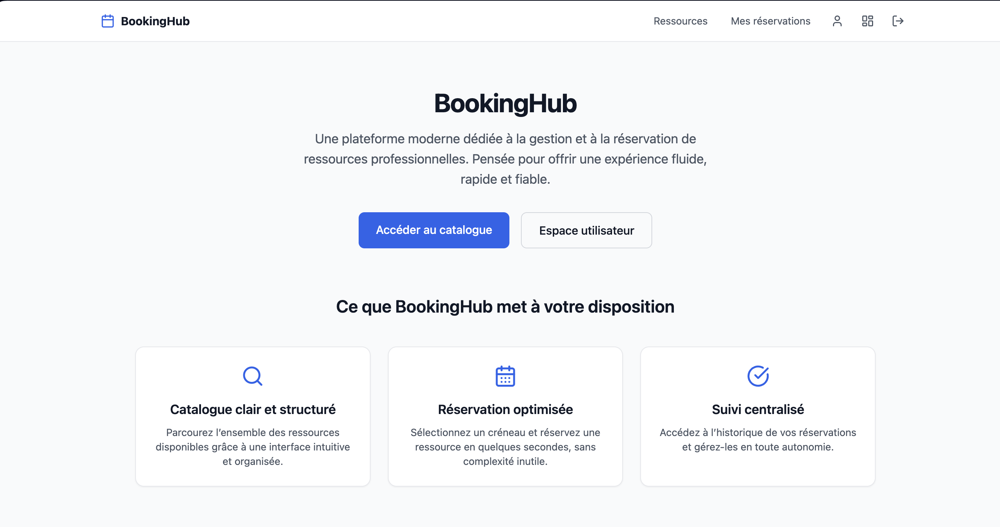
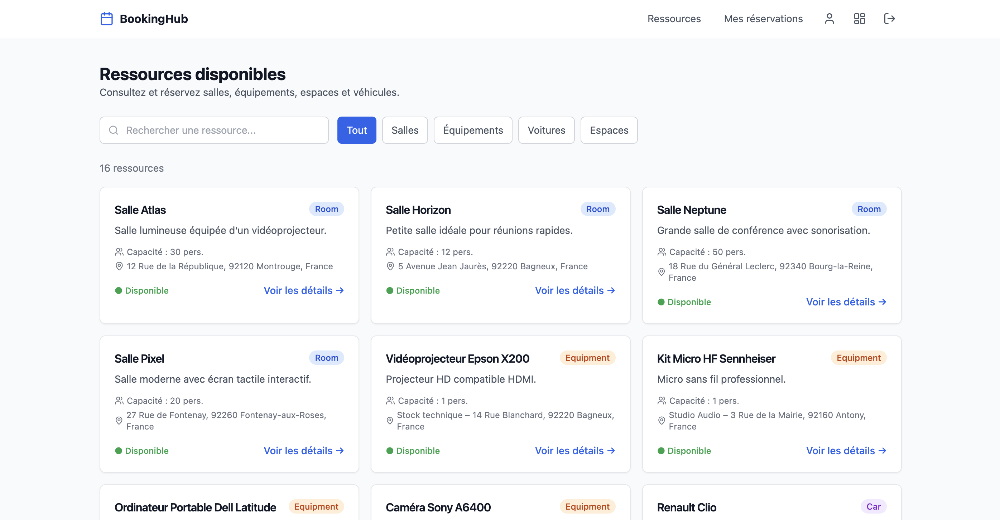
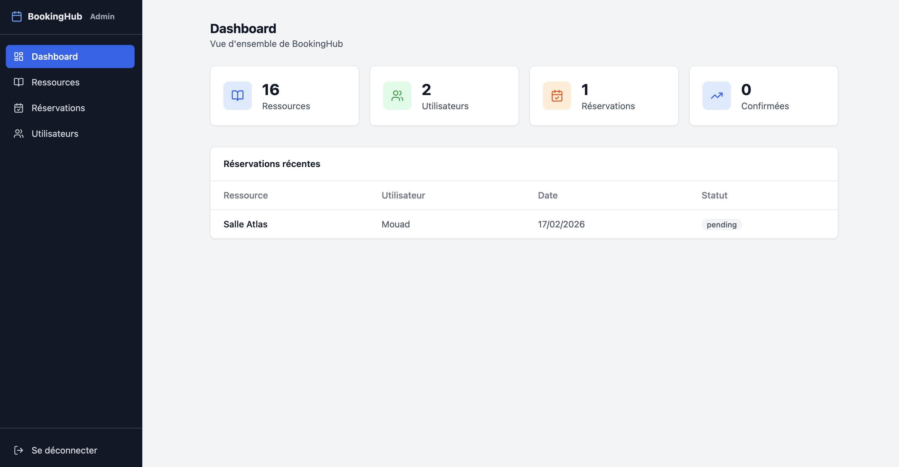

# 📘 BookingHub — Plateforme de réservation de ressources

<div align="center">


<br/>

**BookingHub** est une application **fullstack** permettant de **gérer** et **réserver** des ressources (salles, équipements, etc.) via une **API Symfony sécurisée JWT** et une interface **React moderne**.

</div>

---

## 📌 Présentation

BookingHub est une application qui permet :

- aux **utilisateurs** de consulter les ressources et effectuer des **réservations**
- aux **administrateurs** de gérer les ressources et les réservations via un **panel admin**

L’architecture est séparée :

- **Backend** : Symfony 7 (API REST) + Doctrine ORM + MySQL + JWT (LexikJWTAuthenticationBundle)
- **Frontend** : React + Vite + TypeScript + TailwindCSS
- **Communication** : JSON via `fetch` (wrapper `apiFetch`) avec token JWT

---

## ✨ Fonctionnalités

### 👤 Côté utilisateur
- Authentification (login)
- Inscription (register)
- Consultation des ressources
- Détails d’une ressource (disponibilité, capacité, localisation, description)
- Création de réservation
- Liste “Mes réservations”
- Annulation d’une réservation

### 🔐 Côté administrateur
- Accès protégé via JWT + rôle `ROLE_ADMIN`
- CRUD complet sur les ressources :
  - création / modification / suppression
  - gestion disponibilité
  - description + localisation + capacité
- Liste des réservations (admin)
- Gestion des utilisateurs (admin)

---

## 🧱 Stack technique

**Backend**
- Symfony 7
- Doctrine ORM
- MySQL
- LexikJWTAuthenticationBundle
- Symfony Validator + Serializer Groups

**Frontend**
- React
- Vite
- TypeScript
- TanStack React Query
- React Router
- TailwindCSS
- lucide-react (icônes)

---

## 📁 Architecture du projet

```txt
/backend
  ├── src/
  │   ├── Controller/Api/
  │   │   ├── ResourceController.php
  │   │   ├── BookingController.php
  │   │   ├── AdminResourceController.php
  │   │   └── ...
  │   ├── Entity/
  │   │   ├── User.php
  │   │   ├── Resource.php
  │   │   └── Booking.php
  │   ├── Repository/
  │   └── ...
  ├── config/
  ├── migrations/
  ├── .env
  └── composer.json

/frontend
  ├── src/
  │   ├── api/
  │   │   ├── apiFetch.ts
  │   │   ├── auth.ts
  │   │   ├── resources.ts
  │   │   ├── bookings.ts
  │   │   └── users.ts
  │   ├── context/
  │   │   └── AuthContext.tsx
  │   ├── hooks/
  │   │   └── useAuth.ts
  │   ├── pages/
  │   │   ├── Register/
  │   │   ├── Login/
  │   │   ├── Resources/
  │   │   └── Bookings/
  │   ├── admin/
  │   │   ├── Resources/
  │   │   ├── Bookings/
  │   │   └── Users/
  │   └── components/
  ├── package.json
  └── vite.config.ts
```

---
### Cloner le dépôt

```bash
git clone https://github.com/MOUADx4/booking-hub-64.git
cd booking-hub-64
```

---
## ⚙️ Installation & Lancement

### Backend Symfony

#### 1) Installer les dépendances
```bash
cd backend
composer install
```

#### 2) Configurer `.env.local`
Crée un fichier `backend/.env.local` :

```env
DATABASE_URL="mysql://root:@127.0.0.1:3306/bookinghub"
JWT_PASSPHRASE=your_passphrase
```

#### 3) Générer les clés JWT
```bash
php bin/console lexik:jwt:generate-keypair
```

#### 4) Créer la base + migrations
```bash
php bin/console doctrine:database:create
php bin/console doctrine:migrations:migrate
```

#### 5) Lancer le serveur Symfony
```bash
symfony server:start
```

API disponible sur :
- `http://127.0.0.1:8000/api`

---

## 📸 Captures d’écran

Aperçu du projet :

### 🏠 Page d’accueil


### 📂 Page des ressources


### 🛠 Dashboard Admin


---

### Frontend React

#### 1) Installer les dépendances
```bash
cd frontend
npm install
```

#### 2) Lancer Vite
```bash
npm run dev
```

Frontend disponible sur :
- `http://localhost:5173`

---

## 🔐 Authentification JWT

- Le backend expose un **login JWT**
- Le frontend stocke le token dans `localStorage`
- `apiFetch` ajoute automatiquement :
  - `Authorization: Bearer <token>`

🔒 Les routes admin (`/api/admin/*`) sont protégées et nécessitent `ROLE_ADMIN`.

---

## 🧩 Endpoints API

> Les routes ci-dessous correspondent au projet (Symfony API REST).

### Auth

| Méthode | Route | Description |
|---|---|---|
| POST | `/api/auth/login` | Connexion (renvoie `{ token }`) |
| POST | `/api/auth/register` | Inscription (crée un utilisateur) |

---

### Ressources

| Méthode | Route | Description |
|---|---|---|
| GET | `/api/resources` | Liste des ressources |
| GET | `/api/resources/{id}` | Détails d’une ressource |

---

### Réservations

| Méthode | Route | Description |
|---|---|---|
| GET | `/api/bookings/me` | Mes réservations (JWT requis) |
| POST | `/api/bookings` | Créer réservation (JWT requis) |
| PUT | `/api/bookings/{id}` | Mettre à jour le status |
| DELETE | `/api/bookings/{id}` | Annuler (status = cancelled) |

---

### Admin

| Méthode | Route | Description |
|---|---|---|
| GET | `/api/admin/resources` | Liste ressources (admin) |
| POST | `/api/admin/resources` | Créer ressource (admin) |
| PUT | `/api/admin/resources/{id}` | Modifier ressource (admin) |
| DELETE | `/api/admin/resources/{id}` | Supprimer ressource (admin) |
| GET | `/api/admin/bookings` | Liste réservations (admin) |
| DELETE | `/api/admin/bookings/{id}` | Supprimer réservation (admin) |
| GET | `/api/admin/users` | Liste utilisateurs (admin) |
| DELETE | `/api/admin/users/{id}` | Supprimer utilisateur (admin) |

---

## 🧠 Logique métier & validations

### ✅ Cohérence des données
- Statuts réservation : `pending`, `confirmed`, `cancelled`
- Le frontend affiche ces statuts en français via un mapping UI
- Les IDs Symfony sont des **nombres** (TypeScript côté frontend)

### ✅ Validation backend
- Symfony Validator sur les entités
- Réponses d’erreur structurées (400, 404, 401, 403, 500)
- Sérialisation via `Groups` :
  - `resource:read`, `resource:write`
  - `booking:read`

### ✅ Sécurité
- JWT obligatoire sur :
  - `/api/bookings/*`
  - `/api/admin/*`
- Rôle admin requis pour l’administration

---

## 🎨 Interface utilisateur

- Design moderne (TailwindCSS)
- Composants réutilisables :
  - `Button`, `Input`, `Modal`, `Loader`, `ErrorMessage`
- UX :
  - loaders avec React Query
  - erreurs propres via un composant dédié
  - UI admin séparée (layout admin)

---

## 🧪 Tests rapides (cURL)

### Login
```bash
curl -X POST http://127.0.0.1:8000/api/auth/login   -H "Content-Type: application/json"   -d '{"email":"test@mail.com","password":"password"}'
```

### Register
```bash
curl -X POST http://127.0.0.1:8000/api/auth/register   -H "Content-Type: application/json"   -d '{"name":"Test","email":"test@gmail.com","password":"password"}'
```

### Mes réservations
```bash
curl http://127.0.0.1:8000/api/bookings/me   -H "Authorization: Bearer YOUR_TOKEN"
```

### Créer une ressource (admin)
```bash
curl -X POST http://127.0.0.1:8000/api/admin/resources   -H "Authorization: Bearer YOUR_TOKEN"   -H "Content-Type: application/json"   -d '{"name":"Salle A","type":"room","capacity":10,"location":"1er étage","available":true,"description":"Salle de réunion"}'
```

---
## 👤 Comptes de test

### Administrateur
- Email : test@mail.com
- Mot de passe : password
- Rôle : ROLE_ADMIN  

### Utilisateur
- Email : user@gmail.com  
- Mot de passe : user123  
- Rôle : ROLE_USER  

---

## 📦 Déploiement

### Backend
- Hébergement possible : Render / Railway / VPS
- Variables env à fournir :
  - `DATABASE_URL`
  - `JWT_PASSPHRASE`
- Base : MySQL

### Frontend
```bash
npm run build
```
Déploiement : Netlify / Vercel / OVH

---

## 🧾 Licence

Projet pédagogique (2025/2026). Réutilisation libre dans un cadre d’apprentissage.

---

## 👤 Auteur

**Mouad Bounokra**  
Projet Fullstack — BookingHub (Symfony + React) — 2025/2026
